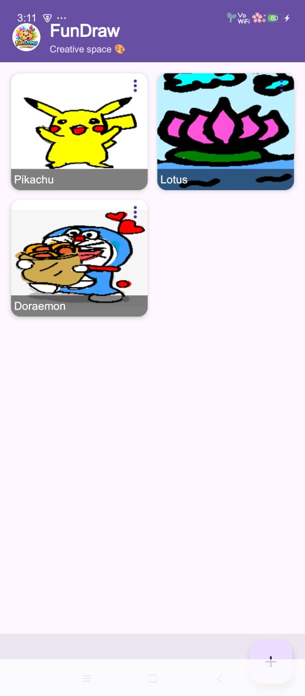
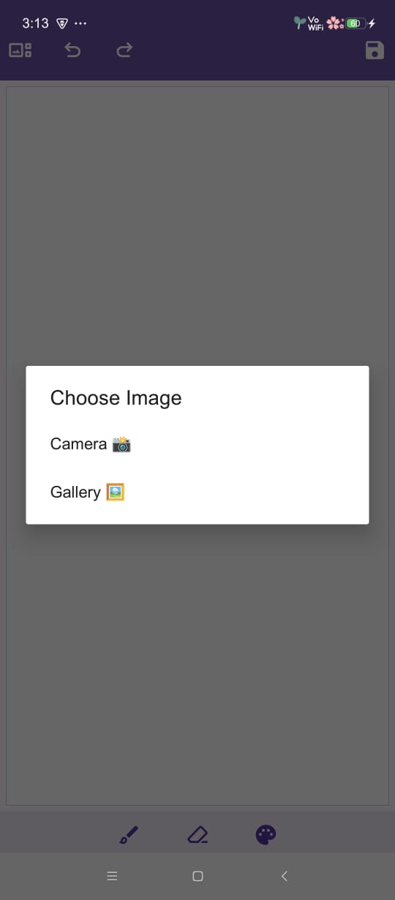
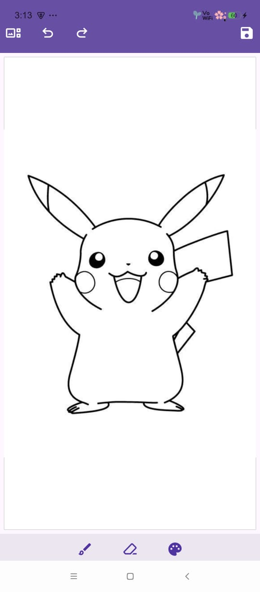
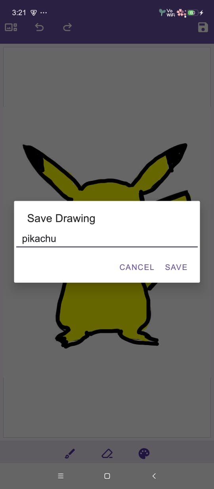

# FunDraw - Your Creative Space 🎨

FunDraw is a simple Android drawing app built with Kotlin. Draw, erase, undo/redo, pick colors, add backgrounds from camera/gallery, save, rename, delete, and share your creations.  

Create freely and keep all your artwork organized in one place!  

---

## Features

- 🖌 **Draw & Erase**: Simple drawing tools to create your masterpiece.  
- 🔄 **Undo/Redo**: Never lose your progress while experimenting.  
- 🎨 **Color Picker**: Choose from a wide palette of colors.  
- 🖼 **Add Backgrounds**: Import from camera or gallery.  
- 💾 **Save & Rename**: Store your drawings with custom names.  
- 🗑 **Delete**: Remove unwanted creations.  
- 📤 **Share**: Easily share your artwork with friends.  
- 📁 **Gallery View**: Browse your drawings in a neat grid.  
- ✨ **Modern UI**: Floating Action Button (FAB) for creating new drawings, clean toolbar, and smooth animations.  

---

## Screenshots

<table>
<tr>
<td></td>
<td></td>
</tr>
<tr>
<td></td>
<td></td>
</tr>
</table>

---

## Getting Started

1. Clone the repository:
```bash
git clone https://github.com/CodeFun1001/FunDraw.git
